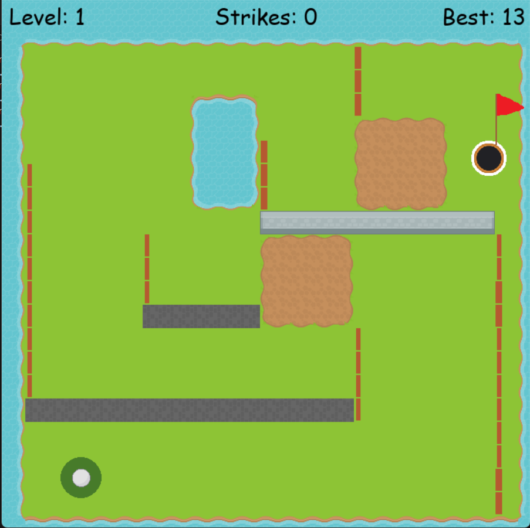

# MiniGolf 🏌️‍♂️
A fun and lightweight mini-golf game built in C++ (or your language) featuring simple physics, multiple holes, and intuitive controls. Ideal for learning game development fundamentals.

# Demo & Media

# Features
- 🎯 Multiple playable holes with obstacles

- 🧮 Realistic ball-and-club physics

- 🔄 Simple level loading system

- 🛠️ Adjustable parameters (gravity, friction, camera)

- 🧩 Modular and extendable codebase
